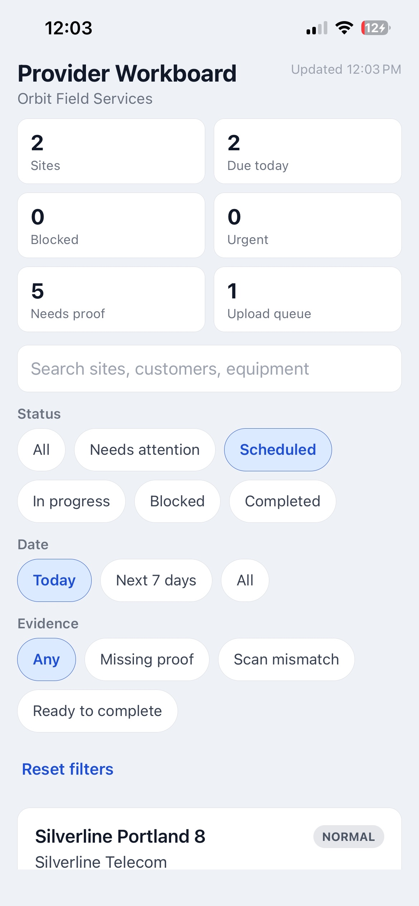
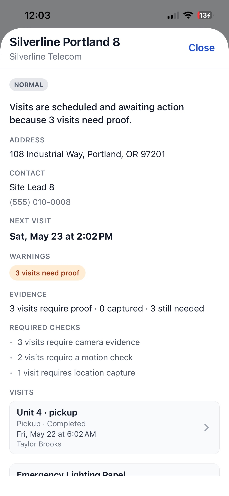
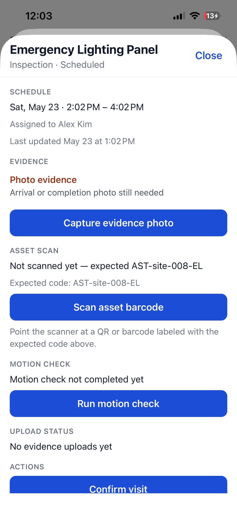
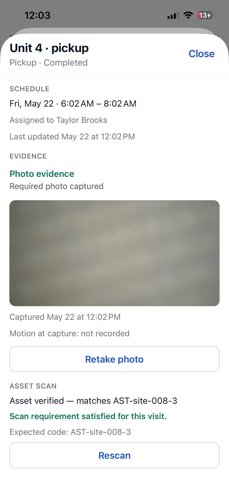
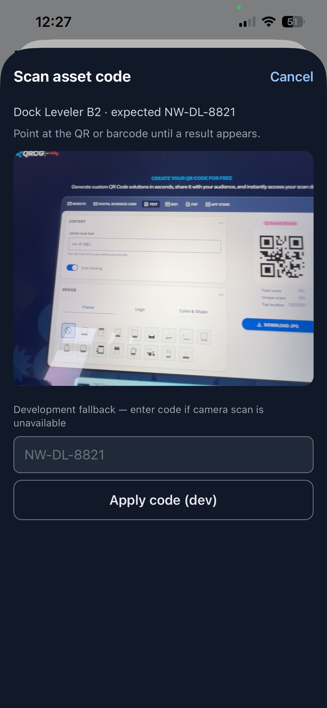
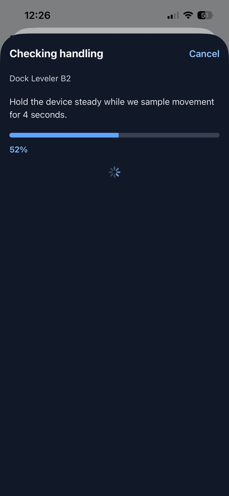
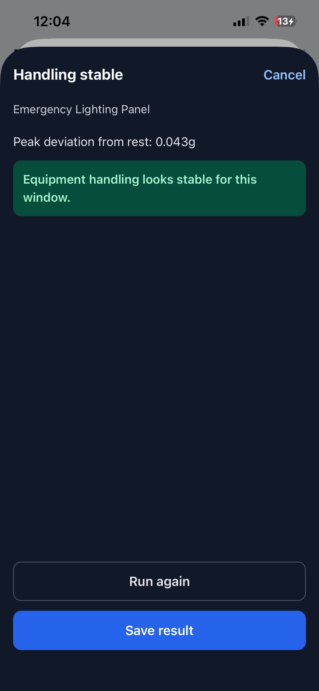

# Orbit Provider Workboard

## How to run the app

```bash
cd orbit-workboard
pnpm install
pnpm start
```

Open the project in Expo Go or a simulator from the Expo dev menu. Requires Node 20.19.4 or newer and pnpm 10+.

## How to run tests

```bash
cd orbit-workboard
pnpm install
pnpm test
```

## Validation commands

Commands run during development:

```bash
pnpm install
pnpm typecheck
pnpm lint
pnpm test
pnpm start
```

`pnpm typecheck` and `pnpm lint` passed. `pnpm test` passed (11 suites, 65 tests). App behavior was checked manually on iOS via Expo Go.

## Known gaps

- Visit actions not implemented: request reschedule, queue evidence upload, retry failed upload.
- Evidence upload stays `queued` after capture; `uploading` / `uploaded` / `failed` are not driven through a live simulated upload flow (labels and test fixtures only).
- `evidence_upload_failed` analytics event is defined but not fired.
- Visit action failure demo requires `simulateFailure: true` in `mockApi.ts`; there is no in-app toggle.
- §9 uses evidence metadata (timestamp + motion snapshot), not GPS or a manual location-denied note.
- §10 uses a stale workboard banner only (not offline banner, upload retry queue, mutation rollback, or persisted evidence queue).

## Screenshots

Captured on iOS via Expo Go.

### Workboard list

Summary header, filters, and virtualized site list.



### Site detail sheet

Site header, visit timeline, and warnings.



### Visit detail — evidence and actions

Visit sheet before required field work is complete:



After evidence capture, asset scan, and motion check:



### Asset scan

Camera scanner with development fallback input.



### Motion check

4-second accelerometer capture in progress and stable result.




